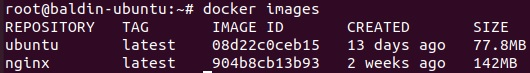
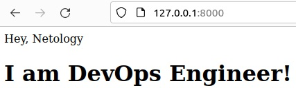

# Домашнее задание к занятию 3. «Введение. Экосистема. Архитектура. Жизненный цикл Docker-контейнера» - Балдин Алексей

## Задача 1

Сценарий выполнения задачи:

- создайте свой репозиторий на https://hub.docker.com;
- выберите любой образ, который содержит веб-сервер Nginx;
- создайте свой fork образа;
- реализуйте функциональность:
запуск веб-сервера в фоне с индекс-страницей, содержащей HTML-код ниже:
```
<html>
<head>
Hey, Netology
</head>
<body>
<h1>I’m DevOps Engineer!</h1>
</body>
</html>
```

Опубликуйте созданный fork в своём репозитории и предоставьте ответ в виде ссылки на https://hub.docker.com/username_repo.

## Решение:

- *Сначала стягиваю образ nginx командой ```docker pull nginx```*

- *Проверяю наличие на хосте нужного образа:* 



- *В нашем случае нет необходимости подкладывать в контейнер измененный файл индекс-страницы. Код небольшой. Думаю, проще внести изменения так:* 

```
#берем за основу скачанный образ nginx 
FROM nginx
#меняем содержимое индекс-страницы. И тут, кстати, апостроф некорректно отображается. Поэтому я его убрал.
RUN echo '<html><head>Hey, Netology</head><body><h1>I am DevOps Engineer!</h1></body></html>' > /usr/share/nginx/html/index.html
```

- *Собираю свой образ nginx: ```docker build -f Dockerfile -t baldinlex/nginx:2.0 .``` и запускаю его (на порту, допустим, 8000): ```docker run -p 8000:80 baldinlex/nginx:2.0```:*



---

## Задача 2

Посмотрите на сценарий ниже и ответьте на вопрос:
«Подходит ли в этом сценарии использование Docker-контейнеров или лучше подойдёт виртуальная машина, физическая машина? Может быть, возможны разные варианты?»

Детально опишите и обоснуйте свой выбор.

--

Сценарий:

- высоконагруженное монолитное Java веб-приложение;
- Nodejs веб-приложение;
- мобильное приложение c версиями для Android и iOS;
- шина данных на базе Apache Kafka;
- Elasticsearch-кластер для реализации логирования продуктивного веб-приложения — три ноды elasticsearch, два logstash и две ноды kibana;
- мониторинг-стек на базе Prometheus и Grafana;
- MongoDB как основное хранилище данных для Java-приложения;
- Gitlab-сервер для реализации CI/CD-процессов и приватный (закрытый) Docker Registry.

## Задача 3

- Запустите первый контейнер из образа ***centos*** c любым тегом в фоновом режиме, подключив папку ```/data``` из текущей рабочей директории на хостовой машине в ```/data``` контейнера.
- Запустите второй контейнер из образа ***debian*** в фоновом режиме, подключив папку ```/data``` из текущей рабочей директории на хостовой машине в ```/data``` контейнера.
- Подключитесь к первому контейнеру с помощью ```docker exec``` и создайте текстовый файл любого содержания в ```/data```.
- Добавьте ещё один файл в папку ```/data``` на хостовой машине.
- Подключитесь во второй контейнер и отобразите листинг и содержание файлов в ```/data``` контейнера.

## Задача 4 (*)

Воспроизведите практическую часть лекции самостоятельно.

Соберите Docker-образ с Ansible, загрузите на Docker Hub и пришлите ссылку вместе с остальными ответами к задачам.

